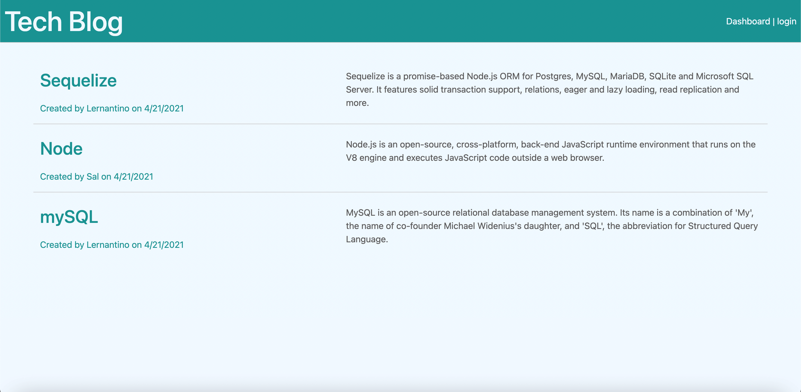

# Tech Blog 
    By Jeff Cameron

## Description
TechBlog provides user with a one stop shop to learn about anything in the tech industy. Users can use this platform to share their own knowledge as well.

## Application Screenshot

## Table of Contents

* [Installation](#installation)

* [Usage](#usage)

* [License](#license)

* [Tests](#test)

* [Questions](#questions)

* [Application Link](#application-link)

## Installation
Please sign in or sign up in order to create a post.

## Usage
This project is used to easily share insight on anything related to tech.

## License
This application is covered under the MIT license.

## Tests
I tested the application on my Local Host and Heroku.

### Questions 
Email me at jeffgcameron@gmail.com

### Application Link
https://salty-reef-93783.herokuapp.com/

https://github.com/jeffgcameron/TechBlog
